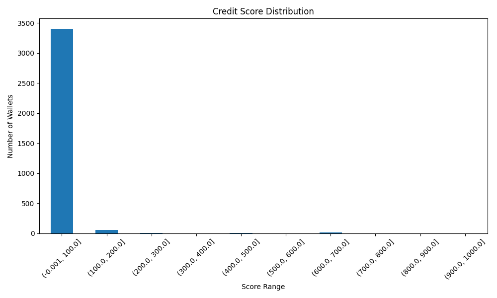

Analysis of Wallet Credit Scores

Score Distribution

Low-Score Wallets (0-200)
       credit_score  deposit_count  borrow_count  repay_count  liquidation_count
count   3459.000000    3459.000000   3459.000000  3459.000000        3459.000000
mean      25.005233      10.234750      4.936976     3.608268           0.071697
std       23.587476      29.386622     15.208406    13.402673           0.696646
min        0.000000       0.000000      0.000000     0.000000           0.000000
25%        9.047045       1.000000      0.000000     0.000000           0.000000
50%       18.094089       2.000000      0.000000     0.000000           0.000000
75%       34.475151       6.000000      3.000000     2.000000           0.000000
max      199.327503     511.000000    200.000000   291.000000          26.000000

High-Score Wallets (800-1000)
       credit_score  deposit_count  borrow_count  repay_count  liquidation_count
count           1.0            1.0           1.0          1.0                1.0
mean         1000.0          139.0           0.0          0.0                0.0
std             NaN            NaN           NaN          NaN                NaN
min          1000.0          139.0           0.0          0.0                0.0
25%          1000.0          139.0           0.0          0.0                0.0
50%          1000.0          139.0           0.0          0.0                0.0
75%          1000.0          139.0           0.0          0.0                0.0
max          1000.0          139.0           0.0          0.0                0.0